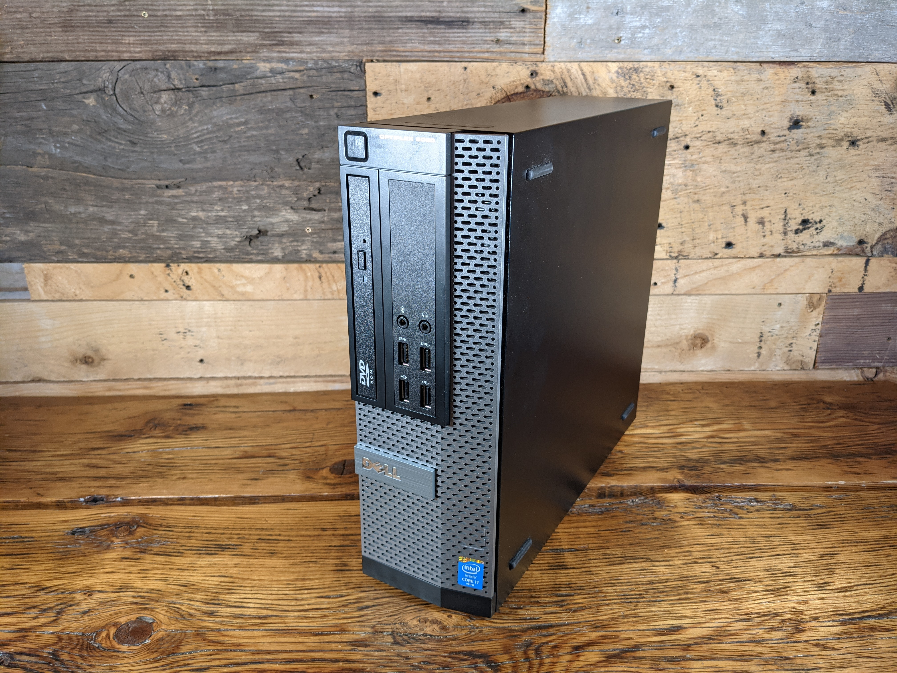
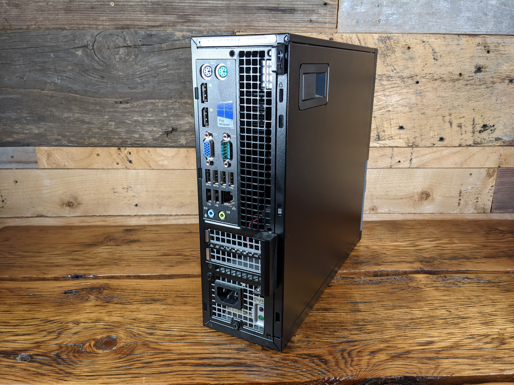

# Installing pfSense and configuring the firewall settings. 
You are going to need a computer to run as your firewall. There are a couple options when it comes to hardware:

1) Buy a [NetGate](https://shop.netgate.com/products/2100-base-pfsense) firewall with pfSense preinstalled.
2) Use an old desktop and flash pfSense on it yourself. 

These next few steps will show you how to turn an old desktop into a pfSense firewall. If you bought a NetGate, then skip ahead to the [Connecting to the home network](https://econoalchemist.github.io/UpstreamData-VPN/02%20Install%20pfSense.html#connecting-to-the-home-network) section.

## Network card
Most desktops only have 1 Ethernet port, but if this is going to be your new firewall, you need at least two Ethernet ports. More than two ports will give you even more customization and flexibility. The Intel i350 network card has four Ethernet ports, this means you can have 1 port for the Wide Area Network connection (WAN) and 3 more ports for different Local Area Network connections (LAN), for example, one LAN for your ASICs, one for your WiFi, and one for your security cameras. You can find an Intel i350 network card on Amazon for ~$160 USD.

  

The desktop used in this guide is a Dell Optiplex 9020 Small Form Factor (SFF). This desktop features an Intel i7-4790 3.6GHz CPU, 16GB of RAM, and a 250GB hard drive. This is more than enough hardware to make a great firewall. 

 
 
 

Inside your desktop there will be a couple Peripheral Component Interconnect Express slots (PCIe), this is where you can add things like graphics cards, sound cards, or in this case, network cards. Open your desktop and insert the network card to the PCIe slot. There might be some blank brackets that you need to remove. 

 
 
 

Once finished, you will have multiple Ethernet connections on your desktop. Now you are ready to flash the pfSense software onto your desktop. 

  

