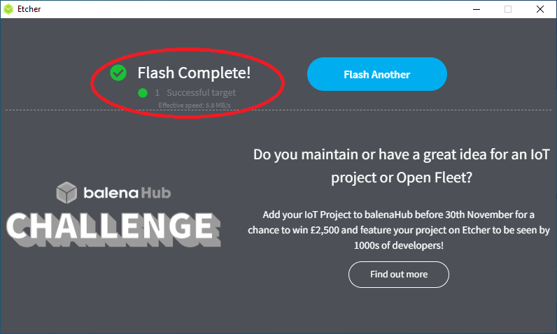

# Installing pfSense
This section will show you how to install pfSense onto your desktop. These steps are not carried out on the desktop you are turning into your firewall, these steps are carried out on a separate desktop or laptop. 

## Download pfSense
First, navigate to [this pfSense download page](https://www.pfsense.org/download/) and once there: 

- Select the `AMD64` Architecture
- Then `USB Memstick installer`
- Then `VGA` Console
- Then select which ever mirror is closest to your geographic location such as demonstrated in the screenshot below and click on `Download`.

  

Once you have that file downloaded, just remember the file location you saved it to. You do not need to decompress the ZIP file.

## Flash pfSense to a USB drive
Now that you have the pfSense software downloaded, you need to flash it to a USB drive. Then this USB drive will be used to boot your new firewall from. 

The easiest way to flash an image file to a USB drive is to use a program called [BelenaEtcher](https://www.balena.io/etcher/). So navigate to that link and download their software and then launch the application. 

Click on `Flash from file`, then navigate to the folder where you have the compressed pfSense image file.

  
  

Next, select your blank USB drive and then click on `Flash`. BelenaEtcher will begin the flashing process and automatically decompress the pfSense image file. This process will take a few minutes. 

  
  

After the flashing is complete, you should get a green check mark indicating that everything checks out. If you get an error from BelenaEtcher, you may need to try flashing to a different USB drive.

  

  

## Install pfSense
Connect a keyboard, monitor, power cable, and the flashed USB drive to your desktop computer that you installed the network card in. The monitor needs to be connected via VGA connections, DisplayPort connections won't work with the image you downloaded from the steps above. Do not connect the Ethernet cables yet. *If you have any data on your desktop that you want to save, this is your last chance to save it before you erase the hard drive.* 

Once everything is connected, power on your desktop. Some computers will automatically detect that there is a bootable USB drive inserted and they will ask you which drive you want to boot from. If not, the computer may just default to booting from the `C:\` drive and launch Windows automatically. If this happens to you, shutdown the computer and then hold down "F12" on the keyboard and turn it back on. This will launch the BIOS where you can tell the computer which drive you want to boot from. 

For example, in this BIOS environment, the SanDisk USB drive can be selected. After selecting this option, a script will run briefly and then the pfSense installer will launch. 

  
  

The installation steps are very easy to follow, just keep following the prompts until the end. These are the recommended settings to choose along the way:

- `Accept`
- `Install pfSense`
- `Continue with default keymap`
- `Guided Root-on-ZFS`
- `Stripe - No Redundancy`
- `Proceed with Installation`
- Choose your main hard drive, for example, `ada0`
- The installer will warn you that this operation will erase all data on your hard drive. select `YES`.
- An overall progress bar will be displayed while the scripts run for a few minutes. 
- At the end of the installation process, you will be asked if you want to open a shell, select `NO`. 
- Then select the option to `REBOOT`.

Immediately remove the USB drive at this time before the reboot kicks back on because otherwise it will drop you at the beginning of the installation wizard again. You should wind up at the main terminal menu once the reboot is finished.   

## Connecting to the home network
The following steps will all be completed on the keyboard and monitor connected to your new firewall. 

- First, power off your ISP provided router, power off your modem, and disconnect the Ethernet cables from your modem and router. 
- Next, pfSense should be loaded and idle like the photo above. Then power on your modem and wait for it to link to the internet.
- In the pfSense menu select option #1 `Assign Interfaces`. It will ask you if you want to setup VLANs now, enter `n` for no. Then it will ask you to enter the WAN interface name, enter `a` for auto-detect.
- Connect an Ethernet cable from your modem output to your new firewall network card interface. Remember, the port on the far right-side if the RJ45 release tabs are facing up is your WAN port. Or the far left-side if the RJ45 release tabs are facing down.
- Once connected, hit enter. It should detect link-up on interface port `igb0`, if it is `igb3` then switch the Ethernet cable to the opposite side and try again.
- Then it will ask you to enter the LAN interface name, enter `a` for auto-detect. Connect an Ethernet cable from the next available port on the new firewall network card to your Ethernet switch or other access point. Keep in mind that if you intend on running a Virtual Local Area Network (VLAN), you will need to use a managed switch.
- Once connected, hit enter. It should detect link-up on interface port `igb1`.
- Then hit enter again for `nothing` as no other network connections are configured at this time. 
- Then it will inform you that the interfaces will be assigned as follows: WAN = `igb0` & LAN = `igb1`.
- Enter `y` for yes and pfSense will write the configuration and bring you back to the main menu with your WAN IP v4 & IP v6 addresses displayed on top. 

Just to illustrate an example signal path configuration, you could do a setup like this:

  

  

At this point, you should be able to enter `192.168.1.1` into your web browser on your regular desktop and launch the pfSense web interface. It is a self-signed certificate, so accept the risk when prompted and continue. The login credentials are `admin/pfsense`.

You can now disconnect the keyboard and monitor from your new firewall. The rest of the steps will be completed through the web interface on your regular desktop.
