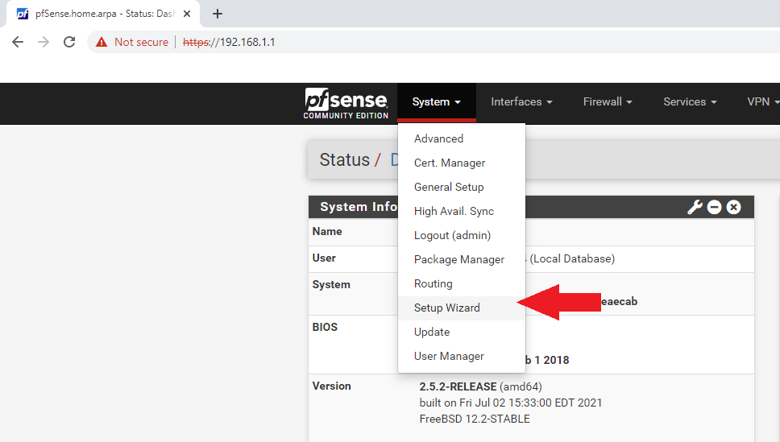
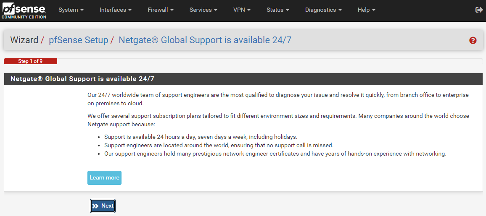
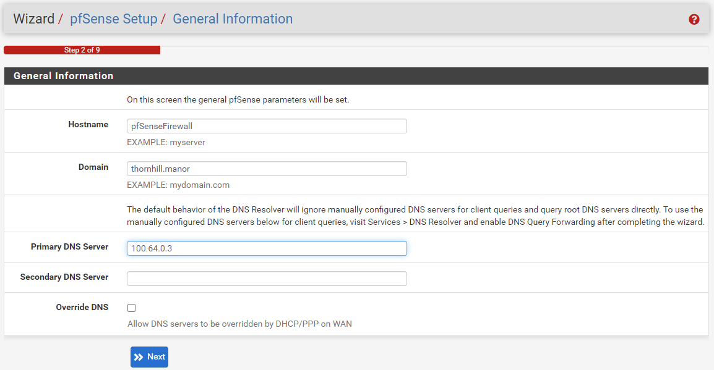
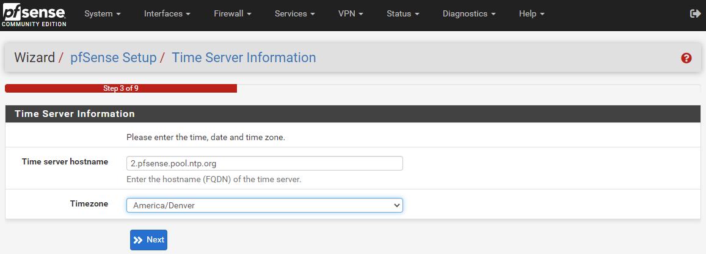
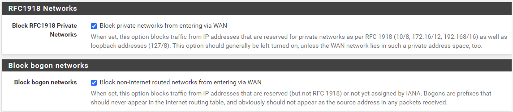
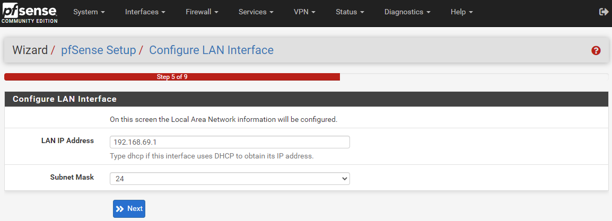
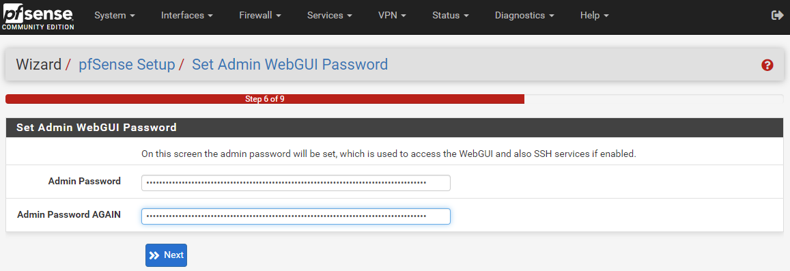
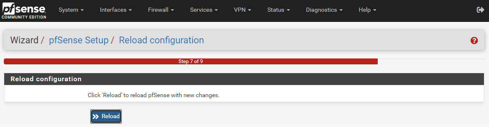
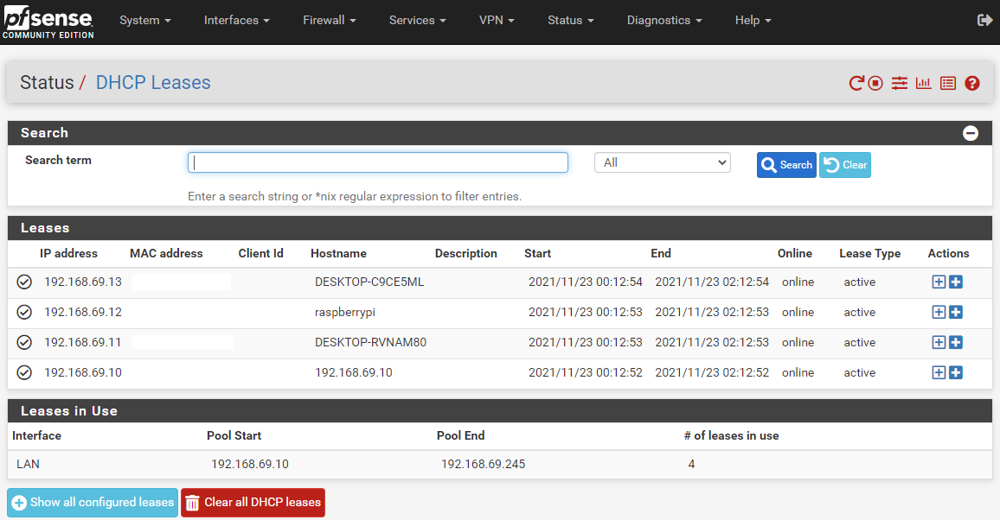

# General Configuration and Settings for pfSense
You should now be able to open a web browser on your regular desktop (not the firewall) and login to your pfSense fire wall with the local IP address, `192.168.1.1` and the credentials, `admin/pfsense`. This section will tell you the basic steps for configuring pfSense. The setup wizard in pfSense makes this very easy and painless.  

For reference, this video is over 2-hours long, but this is an excellent introduction to pfSense. You do not need to watch this video now but most of the information in this guide came from this video. 

-Open the `Setup Wizard` from the `System` tab.

- Click `Next` on the first step.

- Then on the second step you can configure the hostname, domain, and primary/secondary DNS servers. You can leave `Hostname` and `Domain` as their defaults or set them to whatever you want. Using `100.64.0.3` for the Primary DNS Server for getting out to the internet will enable ad-blocking & tracker-blocking. Uncheck the "Override DNS" box to avoid having DHCP override the DNS servers. `100.64.0.3` is Mullvad's DNS server and discussed in the [full guide](https://www.econoalchemist.com/post/bitcoin-home-mining-network-privacy). 

- Set your time zone in step three.

- On the fourth step, you can select `DHCP` for the WAN interface and leave all the other fields as their defaults. If you want to spoof your MAC address you can do so in this step. For the last two fields, ensure the `Block RFC1918 Private Networks` box and the `Block bogon networks` box are checked, this will automatically add the appropriate rules to your firewall. 

- In step 5 you can change your firewall's IP address. Most home local networks will either use `192.168.0.1` or `192.168.1.1` to access the router or firewall. The reason you may want to change this to a none default local IP address is because if you are on someone elses’ network and you are trying to VPN back into your home network then you may run into an issue where you have the same address on both ends and the system won't know if you are trying to connect to the local or remote address. For example, you could change your local IP address to `192.168.69.1`.

- In step 6 you can set your admin password. Use a strong password, if you are not using a password manager, consider doing so. [Bitwarden](https://bitwarden.com/) and [KeePass](https://keepass.info/) are a couple good options.

- Then in step 7 you can click the `Reload` button. As this is reloading, unplug the power cable from your switch. Since the firewall local IP address was changed to `192.168.69.1` (or whatever you chose), all the devices on the network will now have their IP addresses updated to that IP range. So if you have Putty or other SSH sessions configured to your RaspberryPi node for example, you will now need to update those connection configurations. Unplugging the power from the switch, if you are using one, and plugging it back in after the firewall is rebooted helps get all your devices reassigned.

To figure out the IP addresses for the devices on your local network you can navigate to the `Status` tab and select `DHCP Leases` to see everything listed out:

That is it for the basic settings, the good news is that pfSense is rather secure in it's default installation so there is not a whole lot you need to change to have a great basic foundation. Generally, the position of the pfSense developers is that if there is a more secure way to roll out pfSense then they will just make that the default setting. 
