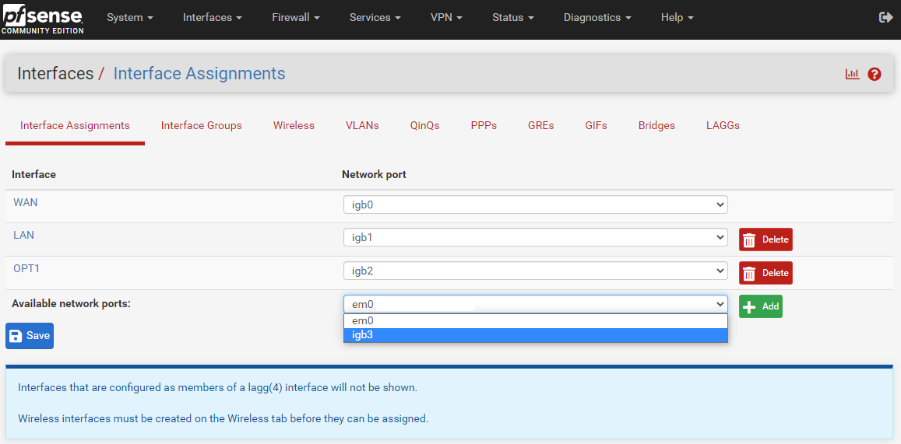
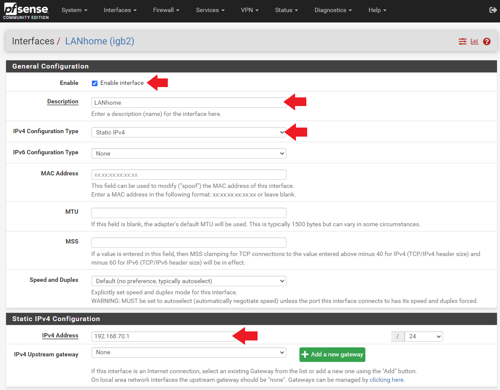
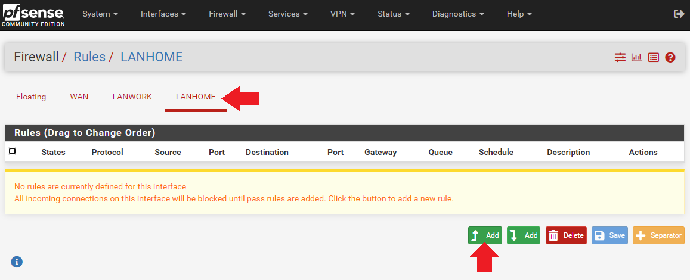
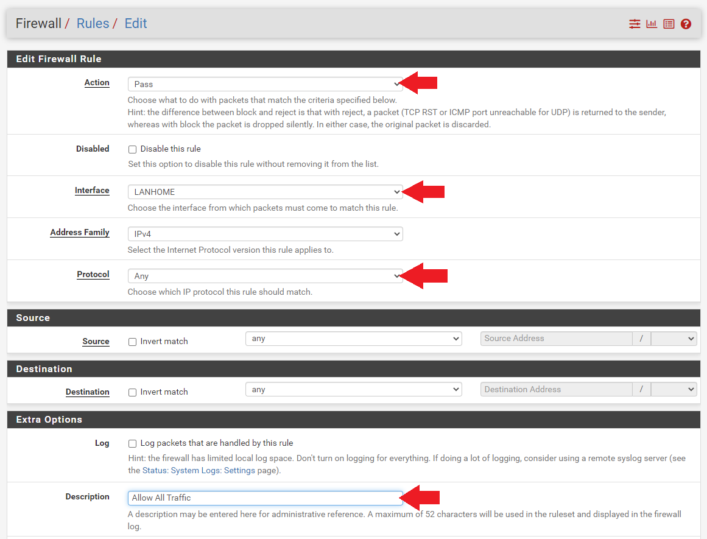
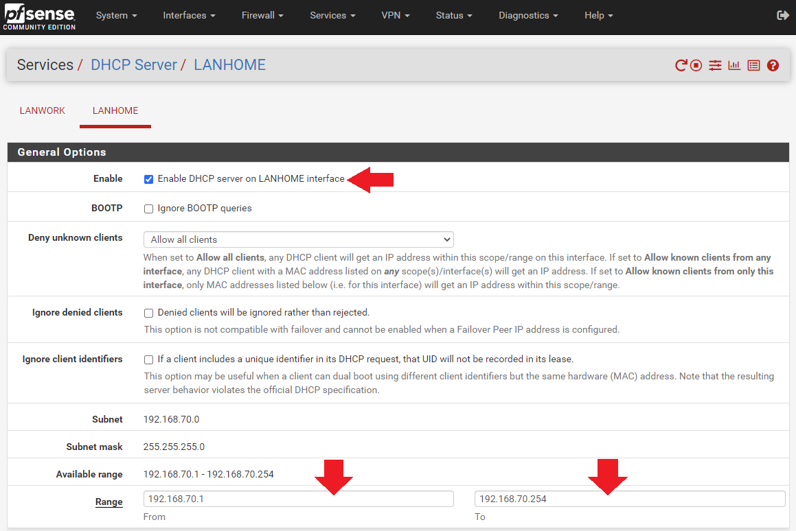
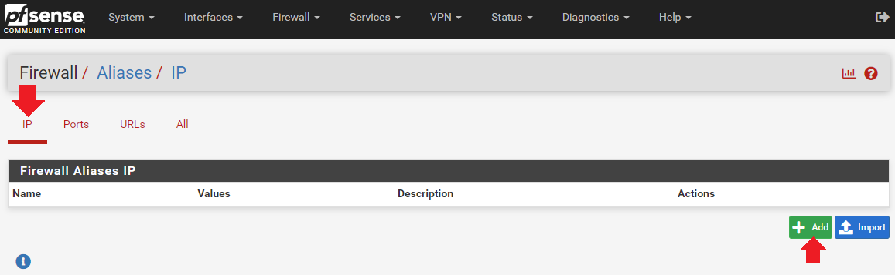
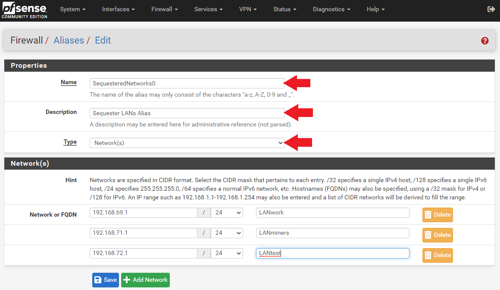
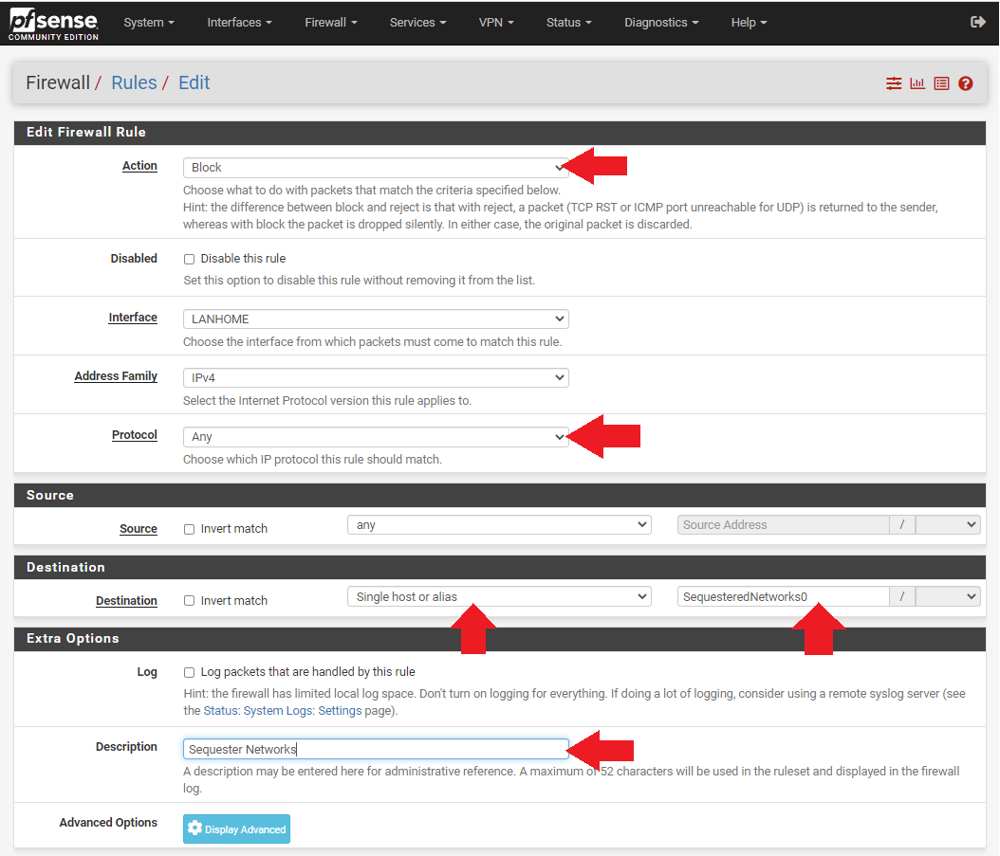
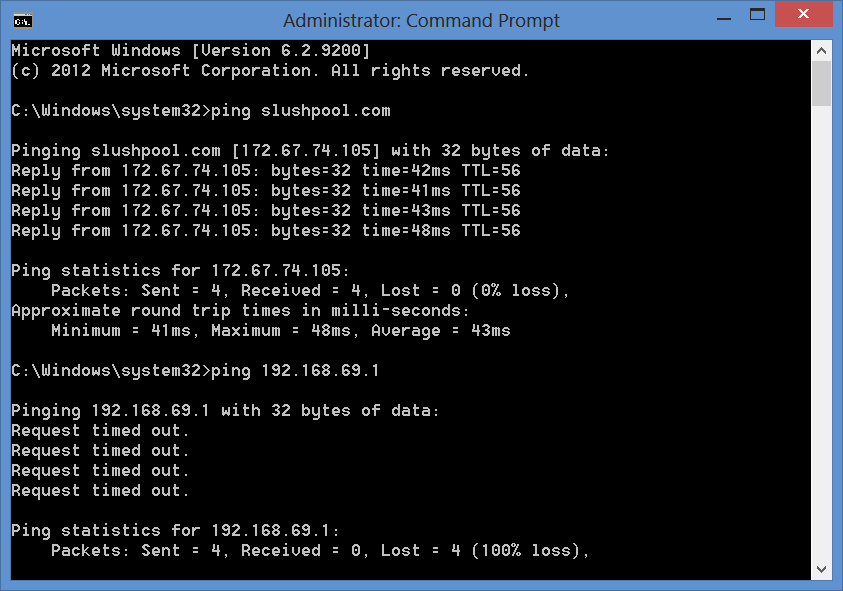

# Activating Additional LANs
Your primary LAN should already be configured, enabled, and passing traffic. You can use one LAN for your whole home network, you have the optionality to add additional LANs using the Ethernet ports on your network card. Some benefits of adding additional LANs is that you can separate different devices to different networks for different purposes. For example, you can have a WiFi access point connected to LAN-1 and allow your family and guests to connect to that for reaching the wide open internet. Then you can configure LAN-2 for all your ASICs, and configure LAN-3 for your security cameras. There is no limit to the possibilities. 

This section will demonstrate how to activate additional LANs. 

- Navigate to the `Interfaces` > `Interface Assignments`, you will see all of your available network card ports. They should be labeled `igb0`, `igb1`, `igb2`, etc. Now, simply add the one you are interested in by selecting it from the drop down menu and clicking on the green "`Add"` box.

- Then click on the hyperlink on the left-hand side of the interface you just added to open up the `General Configuration` page for that interface. 

- Click the `Enable Interface` box.

- Then change the `Description` to something that helps identify it's function, like `LANhome`, for example. 

- Then set the `IPv4 Configuration` type to `Static IPv4` and assign a new IP range. For example, if `192.168.69.1/24` is your primary LAN, you could use a sequential IP range and make this LAN `192.168.70.1/24`. 

- You can leave all the other settings on their defaults, click `Save` at the bottom of the page and then `Apply Changes` at the top of the page.

 

Now you need to setup some firewall rules for this new LAN. 

- Navigate to the `Firewall` tab then `Rules`. 
- Click on your newly added network, `LANhome`, for example. 
- Then click on the green box with the up arrow and the word `Add`. 

- On the next page, make sure the `Action` is set to `Pass`.
- The `Interface` is set to `LANhome` (or whatever your secondary LAN is called).
- Be sure to set the `Protocol` to `Any` otherwise this network will restrict the type of traffic that can be passed on it. 
- Next, you can add a short note to help indicate what this rule is for, such as `Allow All Traffic`. 
- Then all other settings can remain in their defaults and click `Save` at the bottom of the page and `Apply Changes` at the top of the page.

Before you can test your new network, you need to have an IP address setup on it. 

- Navigate to `Services` then `DHCP Server`. 
- Then click on the tab for your new, `LANhome` (or whatever your secondary LAN is called). 
- Click on the `Enable` box and then add your IP address range in the two `Range` boxes. For example, `192.168.70.1 to 192.168.70.254`. Then click on `Save` at the bottom of the page and `Apply Changes` at the top of the page.

Now you can test your new network by physically connecting a laptop to the corresponding port on the network card and then try to access the internet. If everything worked then you should be able to browse the wide open web. 

With this additional LAN added, you can now have a router connected to the first port on the network card and make that your WiFi access point and then you can connect a switch to the second port on the network card and then connect all your ASICs to that switch and have all your devices separated. If you are interested in configuring a WiFi access point please refer to the [full length guide](https://www.econoalchemist.com/post/bitcoin-home-mining-network-privacy/).

## Segregating LANs
You may want to ensure that devices cannot talk across any of your LANs, one use case would be if you wanted to establish a test network to deploy new miners on first so that you can test them in isolation and ensure that they were not delivered with some kind of malicious firmware before putting them on the same network as all your other miners. 

Segregating LANs can be accomplished through the use of Firewall rules and Aliases. 

- Navigate to `Firewall` > `Aliases`. Then under the `IP` tab click on the `Add` button.

- Then name this alias something that describes its function, like: `SequesteredNetworks0`. 
- You can enter a description to remind yourself what its function is. 
- This alias will be used in a firewall rule that will be setup on the LAN that you are trying to separate from the other LANs. For example, the `LAN-2` network. So you want to add your other LANs to the `Network` list. This way, `LAN-2` cannot talk to `LAN-1`, `LAN-3`, or `LAN-4`. 
- Click on `Save` at the bottom of the page and then `Apply Changes` at the top of the page.

Now you can add additional aliases that will be referenced in firewall rules on the other LANs to prevent `LAN-3` from talking to `LAN-1`, `LAN-2`, and `LAN-4`. So on and so forth until all my networks are sequestered in a way that only the firewall can see what is connected on the other networks.

- With the alias created, a new firewall rule can be applied referencing this alias on the secondary LAN. 
- Navigate to `Firewall` > `Rules`, select the LAN you want to apply the rule to, e.g, `LAN-2`. 
- Then for `Action` set it to `Block`. For `Protocol` set it to `Any`. 
- For `Destination` set it to `Single host or alias`. 
- Then enter your alias name. 
- Click on `Save` at the bottom of the page and then `Apply Changes` at the top of the page.

To review, you create a new alias for each LAN. The alias will contain a network list of the other LANs. Then you will add a block rule to each LAN that references the alias for that LAN. This way, you should now be able to plug a laptop into each network card port and try to ping the other networks and get a `request timed out` failure. But you will still be able to reach the wide open internet from each LAN. This is how you can protect devices on your LANs from potential attacks introduced by malicious firmware.

  

