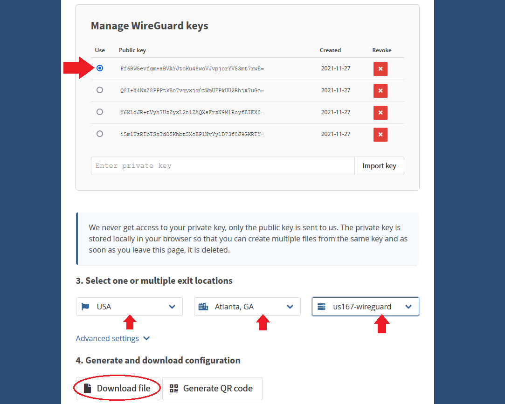

# How to Create a Mullvad Account 
Now that you have pfSense setup, you're ready to get your Mullvad account. Mullvad is simply the provider of the VPN server that you will build an encrypted tunnel to in the next section. But in order to connect to a Mullvad server, you need to set up an account with them and pay for that service. Some reasons Mullvad stands out above the rest:

- No personal information is collected, not even an email address. 
- Bitcoin is accepted as payment.
- The cost is €5 per month. 
- Mullvad does not log IP addresses. 

The basic idea presented in this section is that you will see how to make a Mullvad account and then build the configuration files that you're going to need so that WireGuard has all the information it needs to build the encrypted tunnels in the next section. Please note, that with the kind of configuration presented in this guide is not the same as downloading the Mullvad application from their website, you do not need to download the Mullvad app.  

Navigate to [https://mullvad.net/en/](https://mullvad.net/en/) and click on "Generate Account".

Mullvad does not collect any information from you such as name, phone number, email, etc. Mullvad generates a unique account number and this is the only identifying piece of information you get related to your account so write it down and secure it.   

Next select your payment method. You get a 10% discount for using bitcoin. The subscription works for as long as you want to pay for (up to 12 months) at the rate of €5 per month. So a 1 year subscription for example would be €60 or ~0.002 BTC at today's rate (January 2022). You will be presented with a Bitcoin address QR code to send your payment to.

After confirmation on-chain, the Mullvad account is topped off and should show that you have time remaining, make considerations about selecting a server location from Mullvad's long list of servers. If you're planning on running ASICs behind your VPN, then connecting to a server relatively close to your actual geographic location is recommended to try and help reduce any latency as much as possible. Ideally, you will sect servers that are between your actual geographic location and the location of your mining pool's server. 

The way Mullvad works is with configuration files that assign a unique public/private key pair for each tunnel address. The basic idea here is that there will be a primary tunnel connected to one server and a secondary tunnel connected with another server in a different geographic location just in case the primary tunnel connection goes off line. This way, the mining traffic will automatically switch over to the other tunnel and there will be no interruption in concealing your public IP address or encrypting your traffic data. Each Mullvad subscription alloows for up to 5 key pairs, this means you can configure up to 5 VPN tunnels for €5 per month.  

Navigate to: [https://mullvad.net/en/account/#/wireguard-config/](https://mullvad.net/en/account/#/wireguard-config/) and select your platform, e.g, Windows. Then click on `Generate Keys` for as many key pairs as you want, up to 5 keys. Then click on `Manage Keys` below that to see your list.

Be cautious about sharing this information with anyone, you want to keep your Mullvad keys private. 

- Each configuration file needs to be setup with a specific Mullvad server of your choosing. If you try to configure two tunnels with the same key pair it will not work. 
- Select the `Public Key` you are interested in creating a configuration file for by selecting the circle under the `Use` column next to the appropriate public key. 
- Select the country, city, and server you want to configure with this public key.
- Click on `Download File`. 
- Save the configuration file in a convenient place because you will need to open it in a moment. 

*Remember*, for each tunnel to a new server you want to configure, you will need to use a separate public key. If you try to assign two tunnels to the same key, pfSense will encounter problems with your VPN. 

Repeat this process for as many keys as you generated, selecting a different server for each unique key and generating the configuration file. Naming the configuration file as the city and server used is helpful in a later step.

  

  

Inside the configuration files you downloaded, you will find all the necessary information that WireGuard will need in order to establish your encrypted tunnels. This includes, the private keym, the public key, the host address, and the end point. 

  

