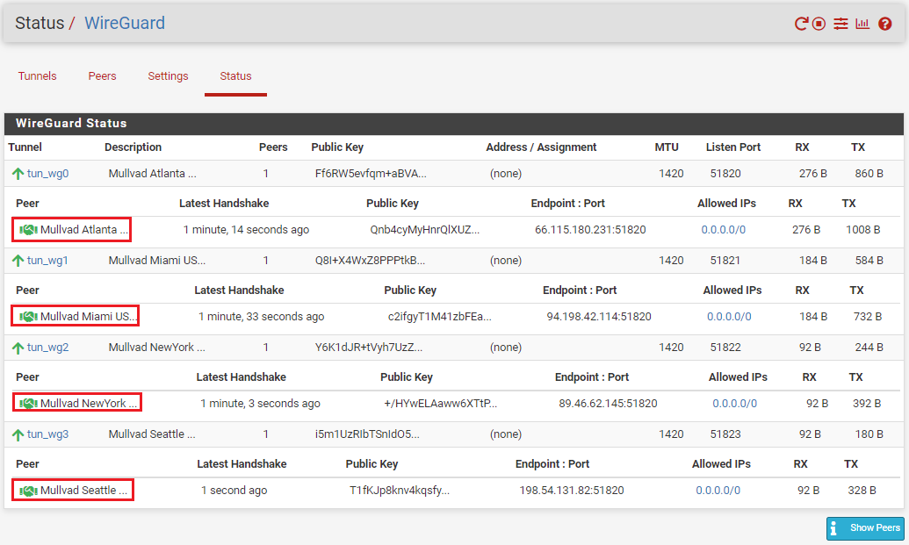

# Configuring WireGuard
This section will show you how to add the WireGuard package to pfSense and then how to use the Mullvad configuration files to setup WireGuard to build your encrypted tunnels.

## WireGuard Package
- The first thing you need to do is add the WireGuard package to pfSense. In pfSense, navigate to `System` > `Package Manager` > `Available Packages` then scroll down to the WireGuard link and click on `Install`. On the next page click on `Confirm`. The installer will run and let you know when it has successfully completed.

- Now you can navigate to `VPN` > `WireGuard` and confirm that the package has been installed but nothing is configured yet.

- Now navigate back to pfSense and go to `VPN` > `WireGuard` > `Settings` and click on `Enable WireGuard` and then `Save`.

## WireGuard Tunnels

- Navigate to the `Tunnels` tab and select `Add Tunnel`.

- Open your first Mullvad configuration file with a text editor like Notepad and keep it to the side. 
- In WireGuard, add a `Description` for your tunnel that describes what it is, like `Mullvad Atlanta US167`.
- Copy/paste the `PrivateKey` from the Mullvad configuration file and add it to the `Interface Keys` dialog box.
- Click on `Save Tunnel`, then `Apply Changes` at the top of the page.

 
 
WireGuard will automatically generate the public key when you paste the private key and hit the `tab` key on your keyboard. You can verify the public key was correctly generated by comparing it to the key on the Mullvad website that you generated earlier.

Repeat this process for as many tunnels as you want. Make sure you use the correct Mullvad configuration file for each one as they all contain different public/private key pairs, IP addresses, and endpoints. 

## WireGuard Peers
Each tunnel will get its own peer. You can add a peer by first navigating to the `Peer` tab next to the `Tunnels` tab that you were just on. Then click on `Add Peer`.

-Select the appropriate tunnel from the drop-down menu for this peer. 
- Add a `Description` for your peer that describes what it is, like `Mullvad Atlanta US167`. 
- Uncheck the `Dynamic Endpoint` box. 
- Copy/Paste the `Endpoint` IP address & Port from the Mullvad configuration file into the `Endpoint` fields in WireGuard. 
- You can give 30 seconds to the `Keep Alive` field. 
- Copy/Paste the `PublicKey` from the Mullvad configuration file into the `Public Key` field in WireGuard. 
- Change the `Allowed IPs` to `0.0.0.0/0` for IPv4. You can also add a descriptor like `Allow All IPs` if you want. 
- Click on `Save`. Then select `Apply Changes` at the top of the page.

Repeat this process for as many peers as you have tunnels. Make sure you use the correct Mullvad configuration file for each one as they all contain different public/private key pairs, IP addresses, and endpoints. 

At this point, you should be able to navigate to the `Status` tab and observe the handshakes taking place by clicking on `Show Peers` in the lower right-hand corner.

## Interfaces
Next, the interfaces need to be assigned for each tunnel. This is similar to how you assigned interfaces to each LAN. 

- Navigate to `Interfaces` > `Interface Assignments`. 
- Select each tunnel from the drop down menu and add it to your list. 

- After all your tunnels are added,  click on the blue hyperlink next to each added tunnel to configure the interface. 
- Click on the `Enable Interface` box. 
- Enter your description, for example: `Mullvad_Atlanta_US167`. 
- Select `Static PIv4`. 
- Type `1420` in the `MTU & MSS` boxes. 
- Now copy/paste the host IP address from your Mullvad configuration file in the `IPv4 Address` dialog box. 
- Then click on on `Add A New Gateway`.

After clicking on `Add A New Gateway`, you will be presented with this pop-up dialog. Enter a name for your new gateway, something easy like the name of your tunnel appended with `GW` for "GateWay". Then enter the same host IP address from the Mullvad configuration file. You can also add a description if you want such as `Mullvad Atlanta US167 Gateway`. Then click on `Add`.

Once you are back at the Interface Configuration page, click on `Save` at the bottom of the page. Then click on `Apply Changes` at the top of the page.

Repeat that process to configure each tunnel interface you added. Make sure you use the correct Mullvad configuration file for each one as they all contain different host IP addresses. 

## Gateway DNS
At this point, you can navigate to your dashboard and monitor the status of your gateways. If you have not done so already you can customize your dashboard to monitor several stats in pfSense. Click on the `+` sign in the upper right-hand corner of your dashboard and then a list of available stat monitors will drop down and you can select the ones you want. 

In the `Gateways` section, you will notice that all the Gateways are online. The gateways will be online so long as the tunnel is active. Even if the remote side is not responding. This is because they are the local interface, so right now they are useless since even if the remote side goes down, they will still show as online. In order to enable the ability to monitor latency so that these gateways can provide some useful stats, they need to be given a public Domain Name System (DNS) address to monitor.  

You'll notice that all the tunnel ping times are `0ms`. That's because no data is being sent out through these tunnels. By pinging a public DNS server, pfSense can get some useful metrics and make decisions about which tunnel will provide the least latency or if a remote server goes down to re-rout traffic. 

You can find a public DNS server to monitor at [this website](https://dnschecker.org/public-dns) or a number of other public DNS server listings. Watch for the recorded uptime percentage, the more the better. You want to find public DNS IPv4 IP addresses to monitor on your IPv4 gateways. Each gateway will need a separate DNS address to monitor.  

- Once you have your public DNS addresses, Navigate to `System` > `Routing` > `Gateways` in pfSense. 
- Click on the pencil icon next to your gateway. 
- You can see that the `Gateway Address` and the `Monitor IP` address are the same on all the gateways. That is why the ping time is 0ms and this is also why pfSense will think the gateway is always up.   

- Enter the public DNS IP address you want to monitor in the `Monitor IP` field and then click on `Save` at the bottom of the screen. 
- Then click on `Apply Changes` at the top of the screen. Remember, gateways cannot share the same DNS monitor address so use a different public DNS server for each gateway to monitor.

Now if you go back to your dashboard and look at your gateway monitor, you should see that there are some actual latency metrics to observe. With this information you can setup your gateways to automatically order themselves in priority based on which ones have the lowest latency for your internet traffic. So for example, if you are mining Bitcoin, then you will want to prioritize your ASICs to go through the tunnel with the lowest latency first. Then if that tunnel fails, the firewall can automatically switch them to the next tier gateway with the second to smallest latency and so on. The nest couple steps will show you how to set up this VPN failover capability. 

 

## NAT Mapping
This step explains how to setup NAT mapping, which the firewall uses to get information from one interface to another. Everything is looking good so far, the tunnels are active and there is data going through the gateways. Next, there needs to be some outbound Network Address Translation (NAT) mapping rules established on the firewall.  

- Navigate to the `Firewall` tab then `NAT` then the `Outbound` tab. This will pull up a list of all your network mappings from your WANs to your LANs. Since you have some new interfaces defined, you want to add these mappings to the list. 
- Click on `Hybrid Outbound NAT Rule Generation` under the `Outbound NAT Mode` section. 
- Scroll to the bottom of the page and click on `Add`.

- Choose your interface from the drop-down menu for example `MULLVAD_ATLANTA_US167`.
- Select `IPv4` for the `Address Family`.
- Select `any` for the `Protocol`.
- Make sure `Source` is on `Network` and then enter the local IP address range for the LAN you want going down this tunnel. For example, for `LANwork` to go through this tunnel to Atlanta, enter `192.168.69.1/24`. 
- Then enter a description if you want such as `Outbound NAT for LANwork to Mullvad Atlanta US167`. 
- Then click on `Save` at the bottom of the page and `Apply Changes` at the top of the page. 

Repeat this process for each of the tunnel interfaces. For example, the `LANwork` network is going to the Atlanta tunnel, the `LANhome` network going to the New York tunnel, and the `LANminers` network is set up for both the Miami and Seattle tunnels. You can set a mapping rule for your mining LAN to all 5 of your tunnels if you want. You can also have multiple LANs mapped to the same tunnel if you want, there is a lot of flexibility.

## Gateway Groups
This part explains how to add multiple gateways to a group. Remember, you established a gateway for each tunnel, so now you can add those tunnel gateways to a groups, then you can route traffic to a gateway group, which will prioritize the tunnel with the least latency in that group.

- Navigate to `System>Routing` and then the `Gateway Groups` tab.

- Enter a group name like `Mullvad_LB_LANMiners`. The "LB" is for "Load Balance".
- Set all the gateway priorities to `Tier 1`. If there are any tunnels you wish to exclude from this group, you can set their priority to `Never`.
- Set the trigger level to `Packet Loss or High Latency`.
- Add a description if you want such as `Load Balance LANminers Mullvad Tunnels`.
- Click on `Save` at the bottom of the screen, then `Apply Changes` at the top of the screen. 

If you navigate to `Status` > `Gateways` and then the `Gateway Groups` tab, you should be able to see your new gateway group online. In theory, if you policy route traffic to `Mullvad_LB_LANminers` then it should balance traffic between the two gateways based on latency.

Now this gateway group can be used in a firewall rule to policy route that traffic accordingly. You can repeat this process to add additional gatway groups if you want. Multiple gateway groups can have the same tunnel in them. There is a lot of flexibility. For example, you could have 2 tunnels in a gateway group and route your WiFi access point traffic through and you could have another gateway group with all 5 tunnels to route your miner traffic through. 

## Firewall Rules
Now that the interface mappings are in place and the gateway groups are established, you can start routing traffic from specific LANs through specific gateway groups. 

- Navigate to `Firewall>Rules` and then the `LANminers` tab or what ever your mining LAN is named. 
- Click on `Add` at the bottom.

- Set the protocol to `Any`.
- Click on `Display Advanced`.

- Scroll down to `Gateway` and select the load balance gateway group you created. 
- Click on `Save` at the bottom of the page and click on `Apply Changes` at the top of the page. 

That should be all that is needed to get your ASICs to switch from one VPN tunnel to another VPN tunnel automatically based on latency or downed servers. If everything worked, you should be able to plug a laptop into your network card port that you will be using for your miners and then open a web browser and navigate to [ifconfig.co](ifconfig.co), this will tell you your public IP address. Your IP address should appear to be coming from one of the tunnels in your gateway group. If you wait a little while and refresh the page you should see the location automatically switch to another tunnel as the latency variables are always changing. 

