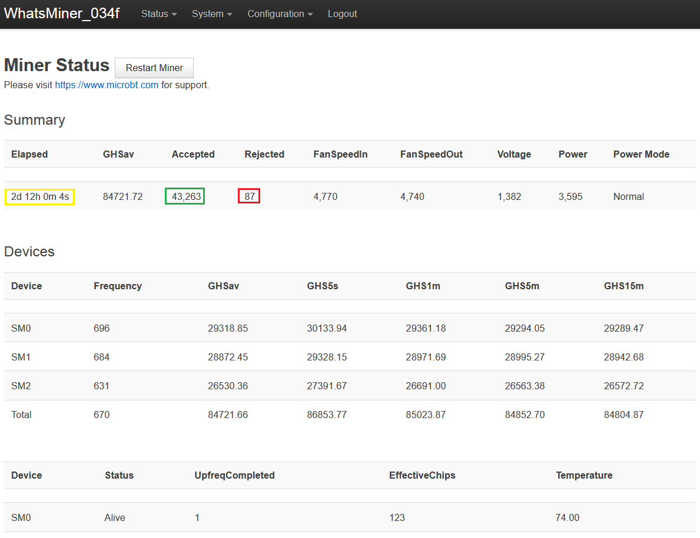
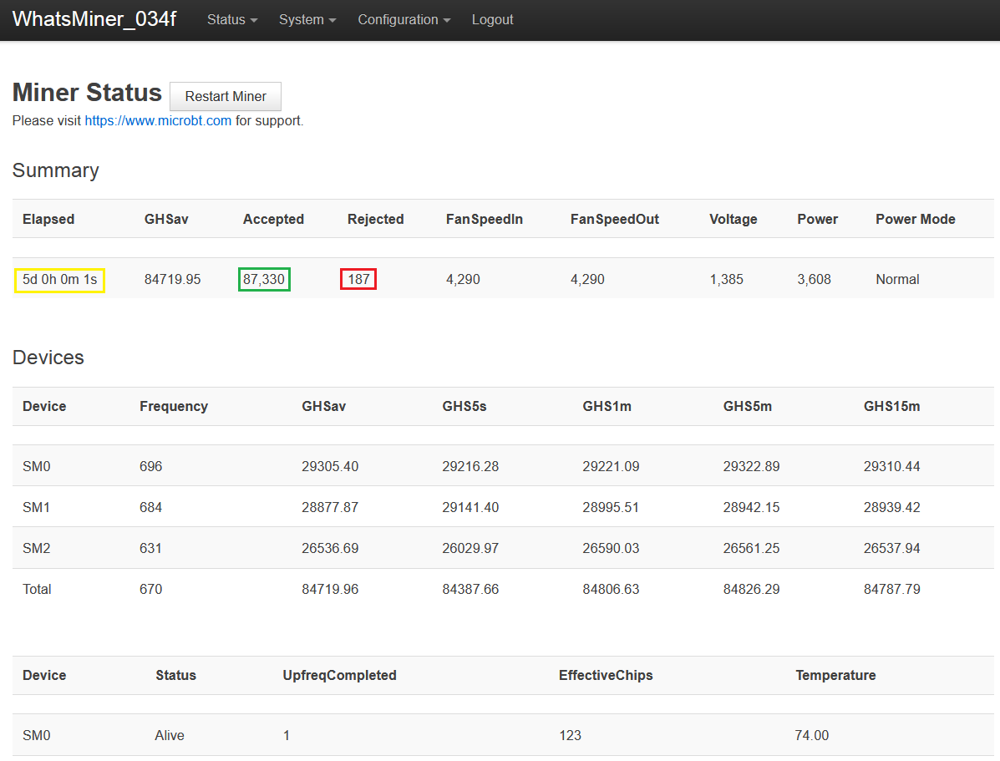

# Testing for Latency
There is reasonable concern that using a VPN may introduce latency to your mining traffic. The problem with that is you will get less rewards. When there is latency present, your ASIC may continue hashing a block header that is no longer valid. The longer your ASIC spends hashing an invalid block header the more "stale" hashrate you will send to the pool. When the pool sees hashes coming in for a block header that is no longer valid, the pool rejects that work. This means that your ASIC just wasted some computing power for nothing, although this is on the scale of miliseconds, when an ASIC is calculating trillions of hashes every second it can add up fast. Typically, this is a very small ratio compared to the amount of work that is accepted by the pool. But you can start to see how significant and continuous latency could have an impact on your mining rewards. 

Generally speaking, the closer two servers are to each other the less latency there will be. With a VPN, mining traffic is sent to the VPN's server and then from there it goes to the pool's server. In an effort to try and mitigate latency by geographic proximity, multiple VPN servers were configured between the miner's location and the pool's server; also,  be cognizant of the risk in having a regional internet outage that perhaps could be mitigated by utilizing VPN servers that are not between the miner and the pool . Below are the results of a miner network configured to load balance traffic between 5 different tunnels over the course of a 5-day test. 

The first 2-1/2 days (60 hours) were spent mining with the VPN on. The second 2-1/2 days were spent mining with the VPN turned off.

In the first 60-hours the ASIC had 43,263 accepted packets and 87 rejected packets. This equates to 0.201% or in other words, 0.201% of the expended resources are not being rewarded. 

After 120-hours the ASIC had 87,330 accepted packets and 187 rejected packets. By subtracting the initial 60-hour readings, while the VPN was turned off, 44,067 accepted packets and 100 rejected packets were left. This equates to 0.226%. Surprisingly, slightly more of a rejection ratio without the privacy benefits of a VPN given the same amount of time. 

In conclusion, by balancing mining traffic between 5 VPN tunnels, privacy benefits of a VPN were gained without reducing the efficiency of the mining operation. In fact, in terms of rejected ratio, the miner did better using the VPN than not using the VPN. 
